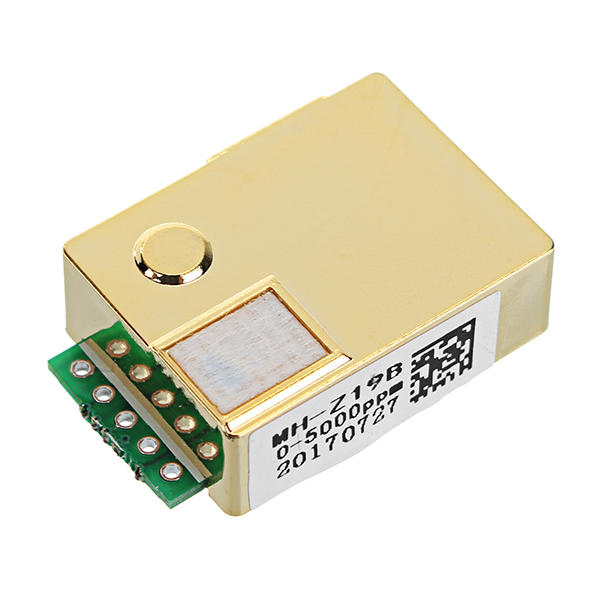
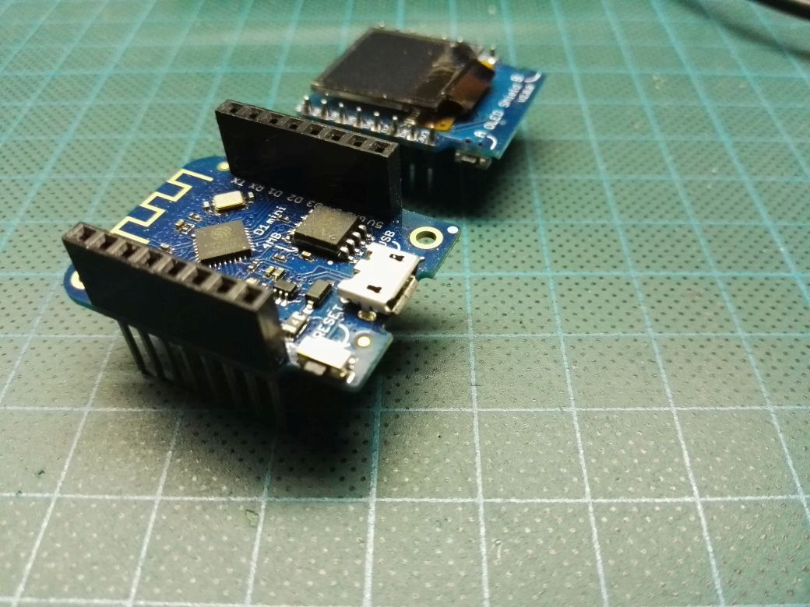
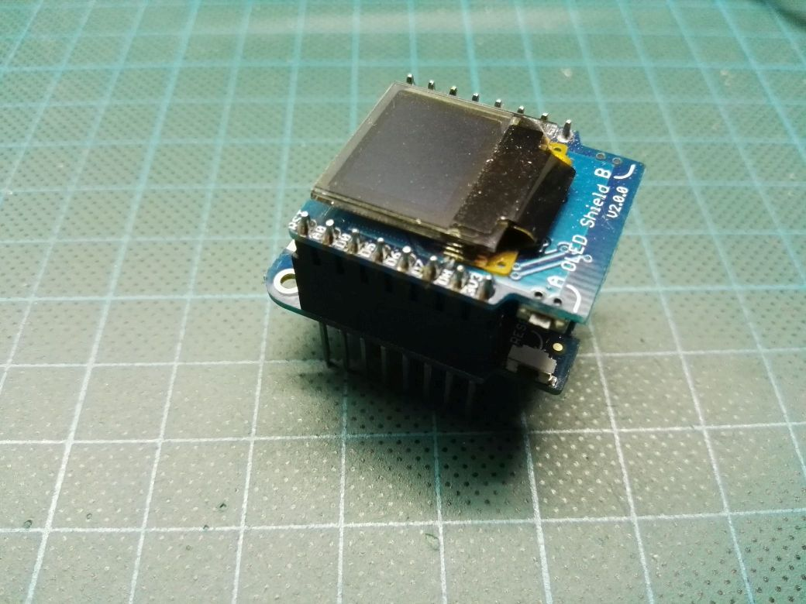
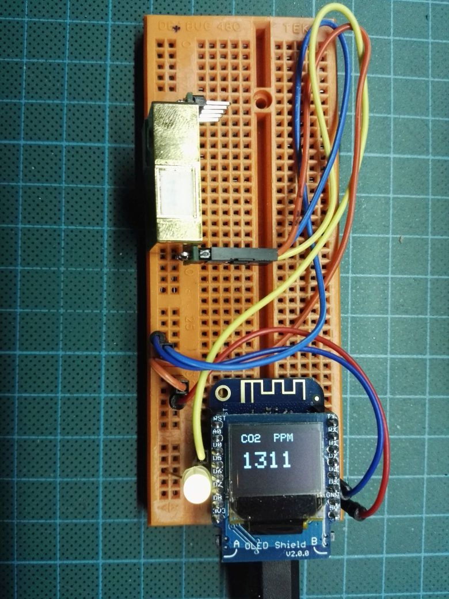
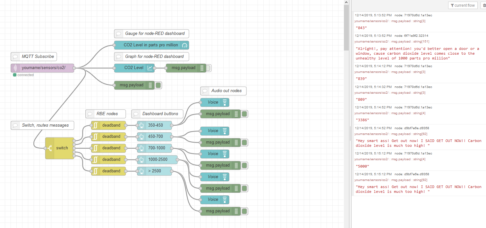
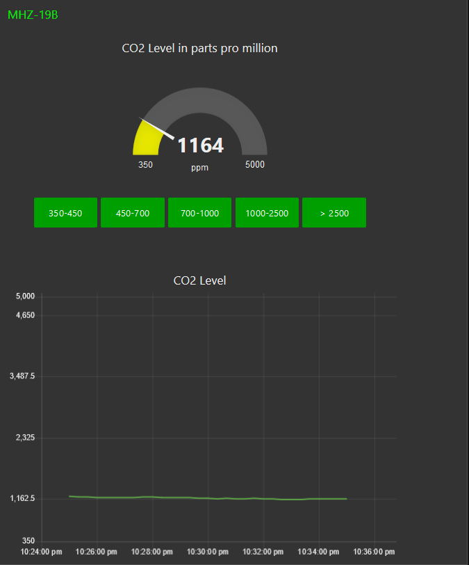

# MHZ19B-PMW-Wemos-D1-mini-Wemos-0.66-inch-OLED-Shield-MQTT-and-node-RED

This is a setup with a Wemos D1 mini, an 0.66 inch Oled shield, CO2 sensor and a RGB Led. The Wemos D1 mini makes a connection with a MQTTbroker and publish the CO2 level to certain Topic. The MQTT broker is hivemq.com, a free and open (no authentication needed) broker, this is very useful for demo purposes where you can use your smartphone as an Access Point ("tethering mode"), or install your own free MQTT Broker like Mosquito. The CO2 level also will be visible on a OLED display and a RGB led.

MQTT Clients (e.g.MQTT.fx),  can subcribe to that Topic and receive the CO2 level. Besides you can use node-RED and the attached flow to link things together. This is done by using a "MQTT in" node in node-RED and subscribe to that Topic.
The node-RED flow creates a simple dashboard and gives audio warnings using Text To Speak nodes.

There are 2 ways to read the data from this CO2 sensor; that is UART or PWM. This CO2 sensor is connected to a Wemos D1 mini and uses pin D5 for the PWM reading.
I compared this sensor with 2 other calibrated CO2 sensors and find a difference of 60-80 ppm which a think is pretty good for this cheap sensor.

<b>Winsum MHZ19B CO2 sensor</b>

<b>Wemos D1 mini with long female header and the  0.66 inch OLED display with short male headers</b>

<b>Wemos and Oled stacked</b>

<b>Breadboard setup</b>

<b>node-RED flow  (<i>Click picture for a better view</i>)</b>

<b>node-RED Dashboard</b>

<a href="https://www.winsen-sensor.com/d/files/infrared-gas-sensor/mh-z19b-co2-ver1_0.pdf">MH-Z19B user's manual</a> 

